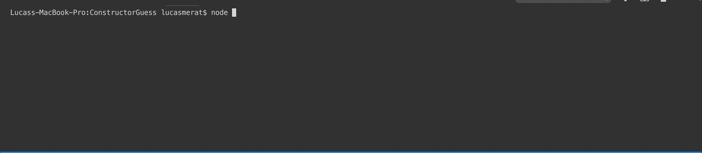

# ConstructorGuess

## Description
A node-based command line word-guess game using object constructors. Created for UT Bootcamp week 10. 

## Install instructions
Clone the repo to your desktop and run `npm install` to install all the dependencies.

### Spotify song info
Once dependencies are installed, run index.js in your command line and enjoy! Demo below:

